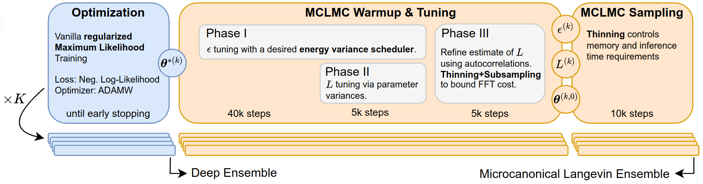
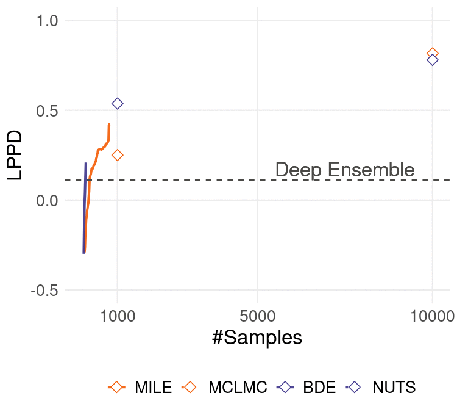

# Microcanonical Langevin Ensembles (MILE)

<p align="center">
    
</p>

This repository contains the code for the **ICLR 2025** submission **"Microcanonical Langevin Ensembles: Advancing the Sampling of Bayesian Neural Networks"**. A flowchart summarizing the proposed method is shown above. 

**MILE** generates high-quality samples significantly faster than competing methods, outperforming sequential approaches like NUTS and MCLMC by a large margin. The GIF below illustrates this with a distributional regression task on the UCI `airfoil` dataset using a fully connected BNN with 3 hidden layers (configs under `experiments/illustrative_example_readme`). Each curve shows **LPPD progression** as more samples are collected, with highlighted points marking the maximum LPPD for each method. The **runtime is proportional to the GIF's speed**, and the dashed line indicates the reference LPPD from Deep Ensemble.


<div align="center">
  
</div>

Below we provide a brief overview of the repository structure and how to run the experiments.

## Setup

We use python `3.10` (higher stable versions should work as well) and [Poetry](https://python-poetry.org/) (make sure you have it installed) to manage dependencies. To install the dependencies within a virtual environment, run the following commands:

```bash
python -m venv venv
source venv/bin/activate
poetry install --with nlp,vision
```

## File Structure

```
.
├── data/                   Data folder (only for small tabular datasets)
├── experiments/
│   ├── analysis_folders/   E.g diagnostics, complexity_ablation, etc.
│   │   ├── config1.yaml    configuration files for the experiments
│   │   ├── config2.yaml
│   │   └── ...
│   ├── plot_results.R      R script to visualize the results
│   └── pool_results.py     Python script to pool the results from multiple experiments
├── src                     Source code powering all the experiments
├── poetry.lock             Poetry generated file for managing dependencies
|── pyproject.toml          Poetry configuration file
├── README.md               This file
└── train.py                Main script for running the experiments
```

## Usage

### Run Experiments

First create the gitignored `results/` folder to store the results:

```bash
mkdir results
```

The individual experiments can be easily exectuted using the `train.py` script. To explore its options, run:

```bash
python train.py --help
```

To run a single experiment on 12 available cores, use the following command:

```bash
python train.py -c experiments/replicate_uci/mclmc.yaml -d 12
```

To run a whole grid of experiments e.g. for the ablation studies or to replicate experiments across multiple data splits/seeds, we use the following command:

```bash
python train.py -c experiments/diagnostics/mclmc.yaml -d 12 -s experiments/diagnostics/diagnostics_search.yaml
```

All the experiments will save their results in the dedicated subfolder of the `results/` folder. The results contain:

- The `config.yaml` configuration file used for the experiment
- The trained deep ensemble models within the `warmstart/` folder
- The posterior samples of the model in the `samples/` folder
- Metrics, diagnostics and training logs
- `report.html` with some useful visualizations, diagnostics and metrics

### Aggregation & Visualization for the Publication

To aggregate the results across multiple experiments we used the `pool_results.py` script and to create the visualizations for the paper we used the `plot_results.R` script. For the latter to work make sure you have the following R packages installed:

```R
install.packages(c(
    "ggplot2", "ggtext", "dplyr", 
    "tidyr", "forcats", "patchwork"
))
```

We used R version `4.1.1`.